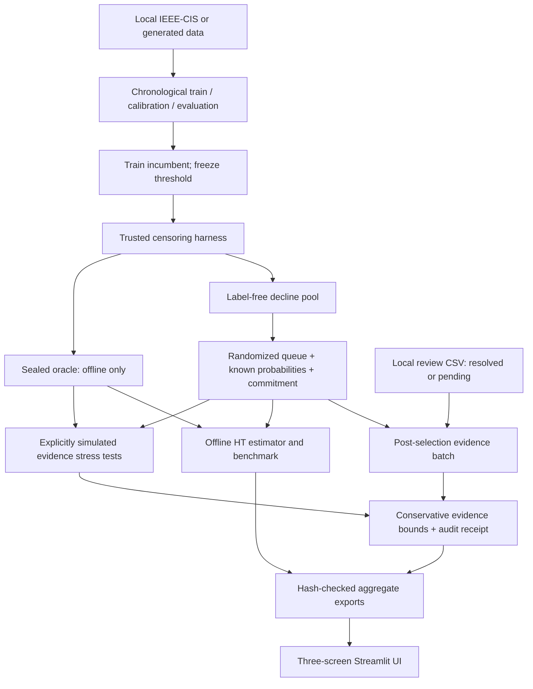

# BlindSpot: judge-facing architecture

The simulation and actual CSV intake are separate paths. The simulator alone uses the sealed oracle to generate artificial delayed/missing/wrong evidence. The actual batch-ingestion path does not read it. The UI reads allowlisted exports; oracle-dependent aggregates have a separate reveal. The reveal controls are presentation gates, not authenticated access control.

| Responsibility | Implementation |
|---|---|
| Data and tie-safe time split | `src/blindspot/data/` |
| Frozen incumbent | `src/blindspot/model/incumbent.py` |
| Product/oracle separation | `src/blindspot/experiment/censoring.py` |
| Label-blind policy and commitment | `src/blindspot/product/` |
| Original primary estimator and repeated draws | `src/blindspot/evaluation/estimators.py`, `sweep.py` |
| Validated evidence batch and conservative bounds | `src/blindspot/evaluation/evidence.py` |
| Prepare/ingest local audit workflow | `src/blindspot/audit.py` |
| Registered secondary stress experiment | `src/blindspot/reliability.py` |
| Source-bound artifact reader | `src/blindspot/dashboard_data.py` |
| Overview, Queue, Budget Lab + evidence stress | `apps/dashboard.py`, `apps/reliability_view.py` |

No hosted model, API key, LLM, database, agent framework or payment execution is required. Original benchmark outputs remain immutable. Raw data, row-level evidence and audit working files stay outside Git. Hashes detect unexpected changes relative to recorded values; they do not authenticate an adversarial operator.
